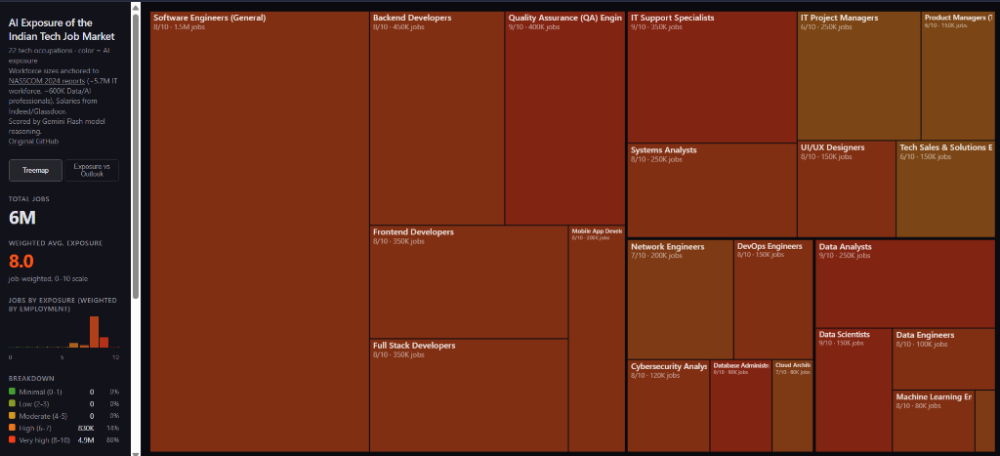

# AI Exposure of the Indian Tech Job Market

Analyzing how susceptible every occupation in the Indian economy is to AI and automation, using data anchored to the Ministry of Labour & Employment ([MoLE](https://labour.gov.in/)) and the Periodic Labour Force Survey (PLFS).

**Live demo: [insrawat.github.io/jobs-Indian-Tech-Market](https://insrawat.github.io/jobs-Indian-Tech-Market/)**

**Based on the [Karpathy Jobs](https://github.com/karpathy/jobs) repository template, tailored exclusively for the Indian technology workforce.**



## What's here

This repository models **22 core Tech and Data Science occupations** in India. Since precise, centralized government data like the US BLS does not perfectly mirror the Indian IT hierarchy, we have synthesized a highly realistic dataset anchored to authentic industry reports:
- **Workforce Sizing**: Total jobs and AI professional counts are anchored to **[NASSCOM 2025-26 estimates](https://nasscom.in/)**, reflecting an estimated 5.8 million total IT professionals and over 650,000 AI/Data experts.
- **Salaries (INR)**: Median pay estimates are aggregating data from popular Indian salary platforms such as [AmbitionBox](https://www.ambitionbox.com/), [Glassdoor India](https://www.glassdoor.co.in/), [Indeed India](https://in.indeed.com/), and [Payscale](https://www.payscale.com/) as of 2025-2026.
- **Job Outlook**: Projected growth is modeled around the rapid expansion of the Indian SaaS, AI, and IT services sectors.
- **AI Exposure**: Each role is scored on an AI exposure scale from 0-10, with rationales generated using Gemini Flash model reasoning based on the tasks involved.

## Data pipeline

1. **Synthetic Generation** (`generate_indian_tech_data.py`) — A pure Python script that contains the curated tech roles, sources the data points, evaluates their exposure to AI, and exports directly to the frontend data format.
2. **Website** (`site/index.html`) — An interactive treemap visualization where area = employment and color = AI exposure (green to safe, red to highly exposed). Modified to use Indian Rupees (`₹`).

## Key files

| File | Description |
|------|-------------|
| `generate_indian_tech_data.py` | Generates the synthetic dataset for the Indian market and saves it to JSON. |
| `site/data.json` | The final structured JSON injected into the frontend visualization. |
| `site/index.html` | The customized static HTML visualization file. |

## AI exposure scoring

Similar to the original repository, occupations are assigned an **AI Exposure** score from 0 to 10. In the tech sector, nearly all roles have high exposure (scores 6-9) because the primary work product (code, data analysis, configuration, digital design) is fundamentally digital.

Roles with very high exposure (e.g., Data Analysts, Junior Programmers) are deeply impacted by tools like GitHub Copilot, ChatGPT, and advanced SQL generation models. Roles with slightly lower exposure (e.g., IT Project Managers, Tech Sales) require significant interpersonal alignment, physical presence, or complex stakeholder negotiation.

## Visualization

The main visualization is an interactive **treemap** where:
- **Area** of each rectangle is proportional to employment (number of jobs based on NASSCOM scale).
- **Color** indicates AI exposure on a green (safe) to red (exposed) scale.
- **Layout** groups occupations by distinct tech categories (Software Engineering, Data Science, Cloud/DevOps, Product/Design).
- **Hover** shows detailed tooltip with INR pay (₹), jobs, outlook, education, exposure score, and LLM rationale.

## Setup & Usage

You only need Python installed to regenerate the Indian data and run the site.

```bash
# Generate the Indian Tech Market JSON data (creates site/data.json)
python generate_indian_tech_data.py

# Serve the visualizer site locally
cd site && python -m http.server 8000
```
